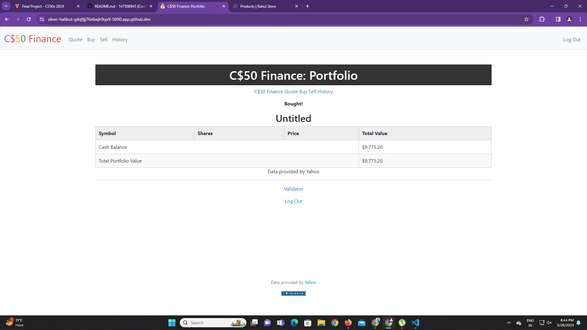

Certainly! Here's a more detailed `README.md` template for your finance portfolio web application:

---

# Finance Portfolio Web App



## Overview
Welcome to the Finance Portfolio Web App! This application is designed to help users manage their stock investments, track their portfolio performance, buy and sell stocks, and view transaction history. It provides a user-friendly interface for interacting with real-time stock data, enabling users to make informed decisions about their investments.

## Features
- **User Authentication**: Secure registration and login functionality with password hashing for user accounts.
- **Portfolio Overview**: Users can view a comprehensive summary of their portfolio, including owned stocks, number of shares, current market prices, and the total value of their investments.
- **Buy and Sell Stocks**: Interactive features allow users to search for stocks by symbol, view real-time market prices, and execute transactions to buy or sell stocks.
- **Transaction History**: Detailed transaction logs provide users with a history of their stock purchases and sales, including timestamps, stock symbols, shares bought/sold, and transaction values.
- **Real-Time Stock Data**: Integration with a finance API (such as the Yahoo Finance API for this example) provides up-to-date stock prices, ensuring accurate and timely information for users.
- **Responsive Design**: The application is designed to be responsive, adapting to different screen sizes for a seamless user experience on desktops, tablets, and mobile devices.

## Technologies Used
- **Backend**: Python, Flask
- **Frontend**: HTML, CSS, Jinja Templates
- **Database**: SQLite for storing user data and transaction history
- **API Integration**: Utilizes the Yahoo Finance API for retrieving real-time stock prices

## Setup Instructions
1. **Clone the Repository:**
   ```bash
   git clone https://github.com/Rahulsharma368/project.git
   cd finance-portfolio/
   ```

2. **Install Dependencies:**
   ```bash
   pip install -r requirements.txt
   ```

3. **Set Up the Database:**
   ```bash
   flask init-db
   ```

4. **Run the Application:**
   ```bash
   flask run
   ```

5. **Access the App:**
   - Open your web browser and go to `http://localhost:5000`
   - Register for a new account or log in with existing credentials
   - Explore the dashboard, buy/sell stocks, view transaction history, and manage your portfolio!

## Usage
1. **Registration and Login:**
   - New users can register for an account with a unique username and secure password.
   - Existing users can log in to access their portfolios.

2. **Portfolio Overview:**
   - The dashboard provides an overview of all owned stocks, displaying symbols, shares, current prices, and total values.

3. **Buying Stocks:**
   - Users can search for stocks by symbol and specify the number of shares they want to buy.
   - Transactions deduct the purchase amount from the user's cash balance.

4. **Selling Stocks:**
   - Selling stocks is easy; users select the stock symbol and the number of shares to sell.
   - Transaction proceeds are added to the user's cash balance.

5. **Transaction History:**
   - Users can view a detailed history of all their transactions, including buys and sells.
   - Each entry includes timestamp, stock symbol, shares traded, and transaction value.

6. **Log Out:**
   - For security, users can log out of their accounts, ending the session.

## Screenshots
Here are some screenshots from the Finance Portfolio Web App:


## Credits
- This project was developed as part of the CS50 Web Programming with Python and JavaScript course.
- Stock data is provided by the [Yahoo Finance API](https://www.yahoo.com/).

## Contributing
Contributions are welcome! If you have ideas for improvements, please feel free to open an issue or submit a pull request.

## License
This project is licensed under the [MIT License](LICENSE).

---


